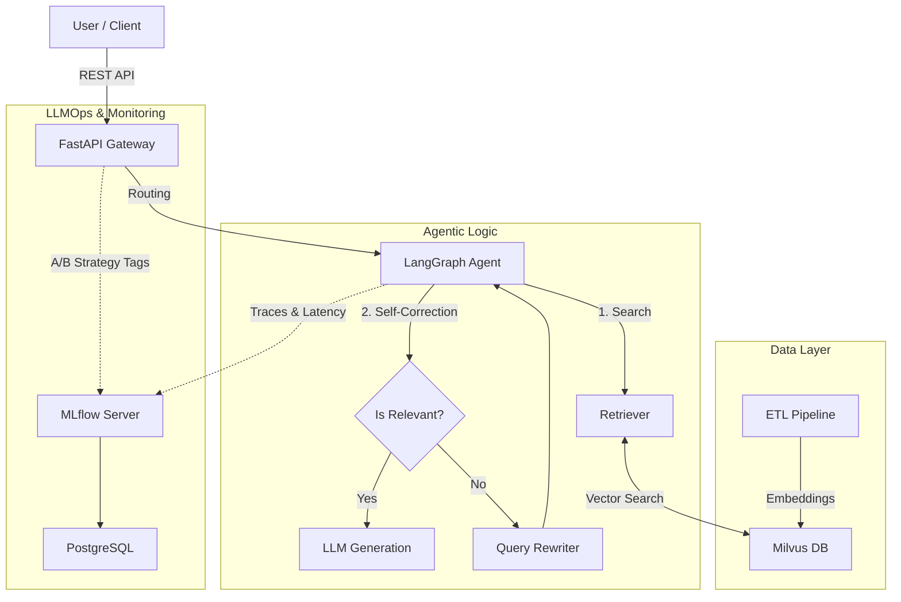

# 🤖 Production Agentic RAG System (LLMOps)


A production-grade **Agentic RAG** system engineered with a focus on **LLMOps**, observability, and reliability. unlike standard "chat with PDF" wrappers, this project implements self-correcting agents, A/B testing infrastructure, and automated quality gates in CI/CD.

## 🏗 Architecture

The system follows a microservices architecture deployable on Kubernetes.



## 🚀 Key Features

* **Self-Correcting Agent:** Uses `LangGraph` to implement a Retrieve-Grade-Generate loop. If retrieved documents are irrelevant, the agent rewrites the query and tries again.
* **Production Vector Search:** Distributed vector storage using **Milvus** (Dockerized) with hybrid search capabilities.
* **LLMOps & Observability:**
* Full tracing of agent steps via **MLflow**.
* Latency, token usage, and cost tracking.
* **A/B Testing:** Dynamic prompt routing (Strategy A vs B) with user feedback loops.


* **Quality Gates (CI/CD):** Automated evaluation pipeline using **Ragas** (Faithfulness & Relevance metrics) running on GitHub Actions.
* **Infrastructure:** Fully dockerized with Kubernetes manifests for production deployment.

## 🛠 Tech Stack

| Component | Technology | Reasoning |
| --- | --- | --- |
| **Orchestration** | LangGraph | Allows for cyclic graphs and state management (essential for agents), unlike linear chains. |
| **Backend** | FastAPI | Async support for high-throughput and streaming capabilities. |
| **Vector DB** | Milvus | Cloud-native, scalable vector database suitable for K8s environments. |
| **Monitoring** | MLflow | Industry standard for experiment tracking and model registry. |
| **Eval** | Ragas | LLM-as-a-judge framework for rigorous pipeline evaluation. |
| **Package Mgr** | uv | Extremely fast Python package installer and resolver. |

## ⚡ Quick Start

### Prerequisites

* Docker & Docker Compose
* Python 3.11+ (and `uv` installed)
* OpenAI API Key

### One-Command Setup (Windows)

```powershell
./start.ps1

```

### Manual Setup

1. **Configure Environment:**
```bash
cp .env.example .env
# Add your OPENAI_API_KEY in .env

```


2. **Start Infrastructure:**
```bash
docker-compose up -d

```


3. **Ingest Knowledge Base:**
```bash
uv pip install -r pyproject.toml
python -m src.ingestion.pipeline

```


4. **Run Server:**
```bash
uvicorn src.api.main:app --reload

```


## 📊 Evaluation & Testing

Run the evaluation pipeline against the Golden Dataset:

```bash
python -m src.eval.evaluate

```

*This script is part of the CI pipeline and will fail the build if `Faithfulness < 0.7`.*

## 🧪 A/B Testing

The system supports live A/B testing of prompt strategies.

* **Strategy A:** Standard Helpful Assistant.
* **Strategy B:** "Dani-Bot" (Technical, Direct MLOps Engineer).

Traffic is split 50/50. View results in MLflow by grouping runs by the `ab_test_strategy` tag.

## 📜 License

MIT